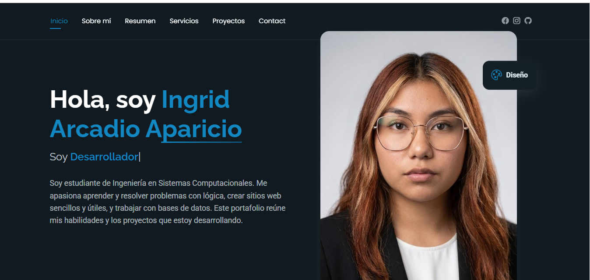
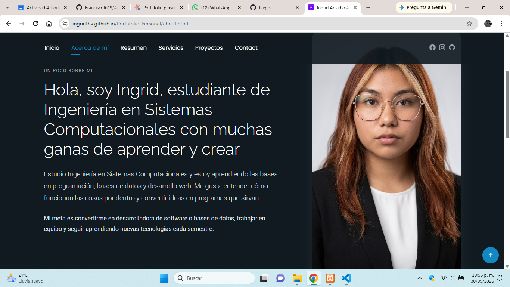
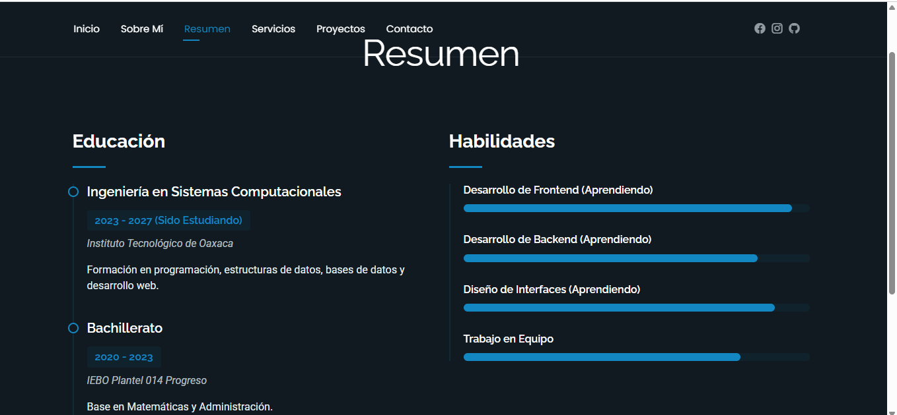
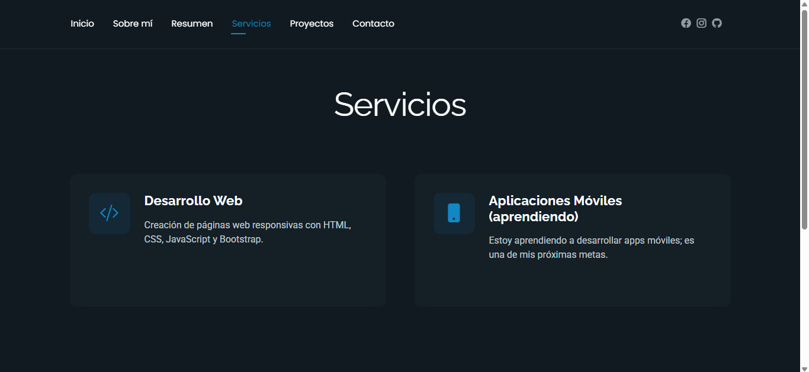
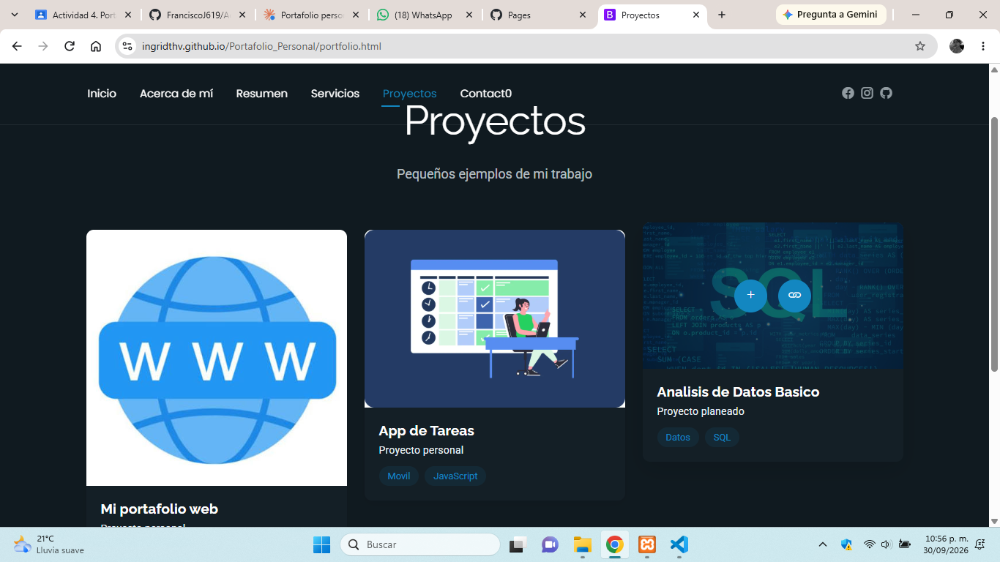
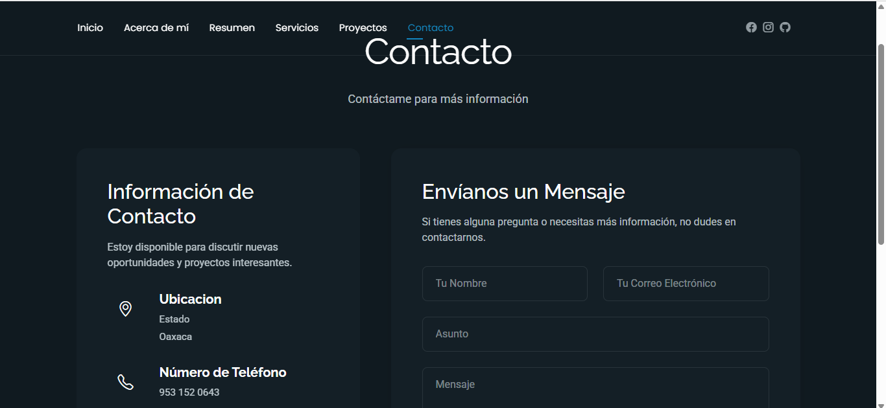

# Portafolio

**Nombre del proyecto:** Portafolio  
**Materia:** Programación Web  
**Actividad:** Actividad 4  
**Autor:** Ingrid Arcadio Aparicio

Portafolio web personal de una estudiante de Ingeniería en Sistemas Computacionales. Presenta quién soy, mi formación, mis habilidades y mis proyectos.

- **Sitio publicado:** https://ingridthv.github.io/Portafolio_Personal/
- **Repositorio:** https://github.com/Ingridthv/Portafolio_Personal

---

## 1. Descripción del proyecto

- **Framework CSS:** Bootstrap 5.3
- **Plantilla:** FolioOne (BootstrapMade)
- **Descarga de la plantilla:** https://bootstrapmade.com/folioone-bootstrap-portfolio-website-template/
- **Tecnologías:** HTML, CSS y JavaScript (sin React ni Vue)
- **Publicación:** GitHub Pages

### Menú y secciones

| Menú | Archivo | Qué contiene |
|---|---|---|
| Inicio | `index.html` | Bienvenida, mi nombre, foto de perfil y enlaces a mis redes. |
| Sobre mí | `about.html` | Presentación, línea de tiempo, pasatiempos y habilidades (HTML, CSS, JavaScript y Python). |
| Resumen | `resume.html` | Educación y habilidades profesionales. |
| Servicios | `services.html` | Áreas en las que trabajo o estoy aprendiendo. |
| Proyectos | `portfolio.html` | Galería con mis proyectos reales y planeados. |
| Contacto | `contact.html` | Datos de contacto, redes y formulario. |

---

## 2. Proceso de creación

1. **Descargué la plantilla FolioOne** de BootstrapMade y la abrí en Visual Studio Code.
2. **Quité el menú desplegable (dropdown)** de todas las páginas, porque no lo necesitaba y así el menú quedó más simple.
3. **Cambié el texto de ejemplo por mis datos:** nombre, presentación, educación, habilidades y datos de contacto.
4. **Puse mi foto de perfil real** en lugar de la imagen de la plantilla.
5. **Completé habilidades y proyectos** con lo que ya sé y con lo que quiero aprender y hacer, como pide la actividad.
6. **Quité lo que no usaba:** testimonios, páginas de ejemplo y fotos de otras personas.
7. **Traduje los textos al español** y revisé que los enlaces del menú funcionaran.
8. **Subí el proyecto a GitHub:**
   ```bash
   git init
   git add .
   git commit -m "Portafolio personal"
   git branch -M main
   git remote add origin https://github.com/Ingridthv/Portafolio_Personal.git
   git push -u origin main
   ```
9. **Publiqué en GitHub Pages:** Settings → Pages → rama `main` → carpeta `/ (root)` → Save.

---

## 3. Capturas de pantalla

### Inicio


### Sobre mí


### Resumen


### Servicios


### Proyectos


### Contacto


---

Plantilla diseñada por [BootstrapMade](https://bootstrapmade.com/) ([Plantilla](https://bootstrapmade.com/folioone-bootstrap-portfolio-website-template/)).